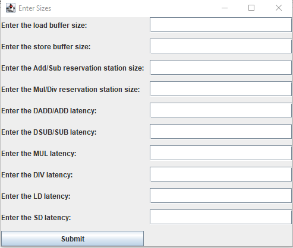
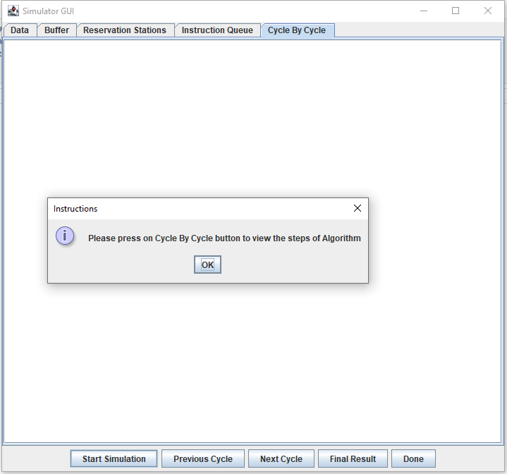
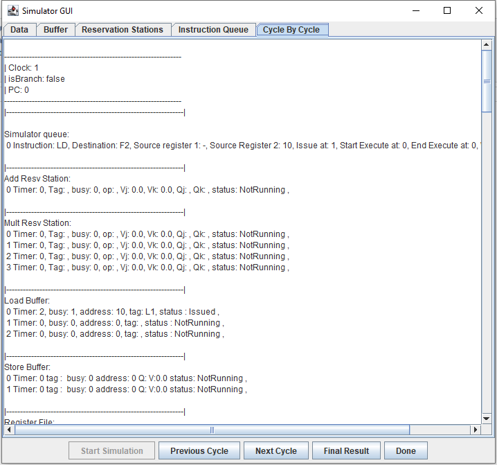

# Project Description
A tomasulo simulator that is implemented in Java where it accepts assembly code in text file and show step by step (cycle by cycle) how the
instructions are executed as well as the content of each reservation station/buffer, the register file, the cache and the queue.)

The simulator handles all types of codes, with and without a loop, and that might contain a combination of RAW (Read After Write), 
WAR (Write After Read) and WAW (Write After Write) hazards.

# Instructions
The simulator accepts the following instructions:
| Instruction  | Function |
| ------------- | ------------- |
| ADD F3 F1 F2  | Adding two floating point numbers in registers F1 and F2, and put result in destination register F3.   |
| SUB F3 F1 F2  | Subtracting two floating point numbers in registers F1 and F2, and put result in destination register F3. |
| MUL F3 F1 F2 | Multiplying two floating point numbers in registers F1 and F2, and put result in destination register F3. |
| DIV F3 F1 F2 | Dividing two floating point numbers in registers F1 and F2, and put result in destination register F3. |
| DADD R3 R1 R2 | Adding two integer numbers in registers R1 and R2, and put result in destination register R3. |
| DSUB R3 R1 R2 | Subtracting two integer numbers in registers R1 and R2, and put result in destination register R3. |
| ADDI R3 R1 7 | Adding integer number in register R1 with immediate (for example 7 here), and put result in destination register R3. |
| SUBI R3 R1 9 | Subtracting integer number in register R1 with immediate (for example 9 here), and put result in destination register R3. |
| BNEZ R5 1 | Check if value in register R5 is not equals zero it jumps to address 1 . |
| LD F5 10 | Load value in dataMemory address 10 in the register F5. |
| SD F5 50 | Store value in register F5 in dataMemory address 50. |

> [!NOTE]  
> We take all latencies as input except for ADDI, SUBI, and BNEZ.

# Assumptions
* Multiple loads and stores can execute at the same time.
* Instructions of type ADD, and DADD take same latencies.
* Instructions of type SUB, and DSUB take same latencies.
* Instructions of type ADDI, SUBI, BNEZ take only 1 cycle.
* Load and store never overlap as we assumed memory is big in size.
* If two instructions want to write back at the same cycle we follow FIFO order.

# How to start the simulator?
### Step 1: Run the "src/takeInput.java" file.

### Step 2: Insert instruction's latency and reservation station/load & store buffer sizes then click on the "Submit" button.

  

### Step 3: Click on the "Start Simulation" button.

  

### Step 4: Click on the "Cycle by Cycle" button to view processing of instructions (issuing instruction, start executing instruction(s), stop executing instruction(s), write back instruction) and view instruction queue in each clock cycle or click on the "Final Result" button to view the final outcome of instruction queue, reservation stations and load/store buffers.

  

